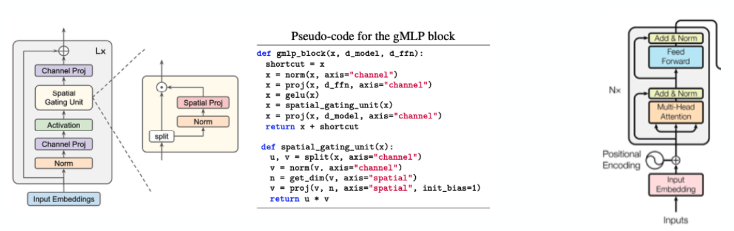

## 강아지 종 분류 모델  
### 1. Introduction
말티즈, 사모예드, 비숑프리제, 스피츠는 모두 하얀 털을 가진 강아지 종이다. 사람 조차 구별하기 힘든 이들을 AI는 구별할 수 있을까? 이번 태스크에서 나는 이들 하얀 털을 가진 4 종류의 강아지를 구별하는 딥러닝 기반 분류 모델을 만든다. 이 프로젝트의 특별함은 현 시점에서 최신 아이디어인 gMLP[3] 아키텍처 최근 급부상하고 있는 딥러닝 프레임워크인 Pytorch-Lightning을 이용한다는 점이다. 


  <br>
  <br>
### 2. gMLP
구글 엔지니어가 제안한 이 gMLP 는, 아래 그림에서 볼 수 있듯이, Transformers[5]의 구조와 다소 유사하다. 실제로, 이 아이디어는 꽤 단순한데, gMLP는 기존의 트랜스포머 구조 내의 Self-Attention을 MLP로 대체하자는 동기로부터 고안되었기 때문이다. 이 과정에서 저자들은 심지어 Transformers 내에서 입력 시퀀스에 대한 고유 정보를 부여하는 Positional Encoding(PE) 마저도 제안된 이 gMLP에서는 필요치 않다고 말한다. 왜냐하면 이 gMLP 내 Spatial Gating Unit(SGU)에서 기존의 PE의 역할을 대신 수행해주기 때문이다.  
gMLP는 이미지 분류, 텍스트 분류에서 기존의 Transformer 혹은 이것의 변형된 형태(BERT 등) 보다 더 좋거나 그들의 성능에 상응하는 수준을 보인다. 


### 3.Experiments
I used  small data for image classification. 

| Architecture | Train Loss | Test Loss |
|-------|-------|-------|
|MLP| 1.386 |5.071|
|gMLP| 0.007 |2.404|

- gMLP is better lol :D


### 3.Improvement Requirement  
현재 수집된 데이터는 Imbalanced data이다. 즉, 각 class 의 데이터 수의 분포가 매우 다르다. 따라서, Imbalaced data 문제[6]를 해소하는 추가적인 작업이 필요하다. 가능한 2 가지 방안은 이것이다: (1) 데이터를 더 수집하기, (2) 불균형 데이터 문제를 해소하는 새로운 모델을 찾아 적용하기. 

### 4. How to implement
<h4>1) Install required libraries</h4>
``` shell
$pip install -r requirement.txt
```
<h4>2) run  </h4>

if you want to use gMLP,
``` shell
$python app.py --mode=gmlp
```
if you want to use basic MLP,
``` shell
$python app.py --mode=basic-mlp
```


### References 
[1] https://towardsdatascience.com/multi-label-image-classification-with-neural-network-keras-ddc1ab1afede
[2] https://medium.com/the-owl/imbalanced-multilabel-image-classification-using-keras-fbd8c60d7a4b  
[3] Liu, Hanxiao, et al. "Pay Attention to MLPs." arXiv preprint arXiv:2105.08050 (2021)  
[4] https://github.com/antonyvigouret/Pay-Attention-to-MLPs/blob/master/models.py  
[5] Vaswani, Ashish, et al. "Attention is all you need." Advances in neural information processing systems. 2017.  
[6] https://machinelearningmastery.com/what-is-imbalanced-classification/
### My Presentation for this paper [3]

https://www.youtube.com/watch?v=ojHBh2bE2BY
